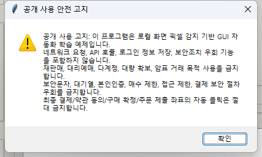
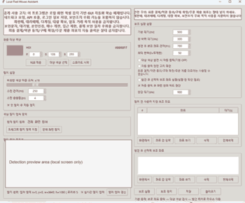

# Local Pixel Mouse Assistant

로컬 화면 픽셀을 감지해 사용자가 지정한 범위 안에서 마우스 이동을 보조하는 GUI 자동화 학습 예제입니다.

이 프로젝트는 특정 서비스 공략, 자동 구매, 대량 확보를 목표로 하지 않습니다. Windows 로컬 화면을 캡처해 픽셀 색상을 비교하고, 사용자가 지정한 GUI 요소 주변으로 마우스 이동을 보조하는 방식만 다룹니다.

## 안전 고지

이 프로그램은 네트워크 요청, API 호출, 로그인 정보 저장, 보안조치 우회 기능을 포함하지 않습니다. 화면 픽셀을 로컬에서 읽고 사용자가 지정한 범위 안에서 마우스 이동 또는 제한적 클릭을 보조하는 도구입니다.

사용자는 각 서비스의 이용약관과 관련 법령을 직접 확인하고 준수해야 합니다. 개발자는 위법, 부정 사용을 지원하지 않습니다.

## 금지되는 사용

- 입장권, 공연권, 스포츠 경기 티켓 등의 재판매 또는 알선 목적 사용 금지
- 구입가 초과 판매, 대리예매, 다계정 예매, 대량 확보 목적 사용 금지
- 보안문자, 대기열, 본인인증, 매수 제한, 접근 제한, 결제 보안 절차 우회 금지
- 예매처 또는 서비스 제공자가 금지한 자동화 행위 금지
- 최종 결제, 약관 동의, 구매 확정, 주문 제출 좌표의 자동 클릭 금지
- 특정 예매처를 대상으로 한 공략법, 좌표 프리셋, 자동구매 루틴 공유 금지
- 위 목적의 이슈, PR, 설정 파일, 사용법 문의는 지원하지 않으며 삭제될 수 있음

공개 저장소에는 특정 사이트용 좌표 설정 JSON, 공략성 좌표 프리셋, 자동구매 목적의 사용법을 올리지 마세요.

## 기능

- 찾을 대상 색상 직접 선택
- 화면 위 색상을 스포이드 커서로 클릭 선택
- 스포이드 옆 실시간 색상 프리뷰와 RGB/HEX 표시
- RGB 값 직접 입력
- 드래그로 색상 탐지 캡처 영역 지정
- 지정한 캡처 영역 안에서만 대상 색상 탐지
- 탐지 캡처 영역 또는 전체 화면 캡처 프리뷰
- 실시간 탐지 캡처 프리뷰 갱신
- 허용 오차로 비슷한 색상까지 탐지
- 대상 색상 발견 시 기본 동작은 마우스 이동만 수행
- 탐지 전 사용자 지정 보조 좌표 설정
- 보조 좌표별 대기시간 설정
- 좌표 값 직접 입력과 입력창 내 실시간 마우스 좌표 표시
- 보조 설정 저장 및 불러오기
- 좌표 실행 순서와 대기시간 표시
- 자동 클릭은 기본 OFF, 안전 고지 확인 체크 후에만 사용 가능
- 발견 후 선택적 보조 좌표는 기본 OFF, 실행 전 사용자 확인 필요
- 최대 반복 기본값 50회, 0=무제한 선택 시 경고 확인

## 스크린샷





## 실행

Windows에서 Python 3.10 이상을 권장합니다.

```powershell
python .\geturticket.py
```

기본 점검은 다음 명령으로 실행할 수 있습니다.

```powershell
python .\geturticket.py --smoke-test
```

## 사용 순서

1. 앱을 실행하고 공개 사용 안전 고지를 확인합니다.
2. `대상 색상 선택`, `스포이드 시작`, 또는 RGB 입력으로 찾을 대상 색상을 지정합니다.
   - 스포이드는 원하는 GUI 요소 색상 위에서 왼쪽 클릭하면 선택됩니다.
   - 스포이드 중에는 커서 옆에 현재 색상 프리뷰와 RGB/HEX 값이 표시됩니다.
   - `Esc` 또는 오른쪽 클릭으로 스포이드를 취소할 수 있습니다.
3. `비슷한 색상 허용 오차`를 조절합니다. 값이 클수록 유사한 색상도 더 많이 잡습니다.
4. 필요한 경우 `드래그로 탐지 영역 지정`을 눌러 대상 색상을 찾을 화면 부분만 지정합니다.
   - 지정한 영역의 `x`, `y`, `w`, `h` 좌표가 앱에 표시됩니다.
   - 이 캡처 영역이 실제 색상 탐지 범위입니다. 색상 검색은 이 영역 안에서만 일어납니다.
   - 지정하지 않으면 전체 화면 캡처 안에서 탐지합니다.
5. `탐지 캡처 프리뷰`에서 현재 색상 탐지 범위를 확인합니다.
   - `실시간 탐지 캡처`가 켜져 있으면 탐지 범위의 화면 변화가 자동으로 갱신됩니다.
   - `탐지 캡처 갱신`을 누르면 현재 탐지 범위를 한 번 다시 캡처합니다.
6. 단순 탐지는 `탐지 시작`을 누릅니다. 대상 색상을 찾으면 마우스 커서만 해당 위치로 이동합니다.
7. 선택적으로 오른쪽 `보조 실행 설정`에서 사용자 지정 보조 좌표를 설정할 수 있습니다.
   - `탐지 전 사용자 지정 보조 좌표`는 대상 색상을 찾기 전 사용자가 지정한 좌표를 제한적으로 누르는 기능입니다.
   - 기본 대기시간은 보수적으로 설정되어 있으며, 좌표가 많으면 실행 전 경고가 표시됩니다.
   - `보조 실행`의 기본 최대 반복은 50회입니다.
   - 최대 반복을 `0`으로 두면 무제한 반복 경고 확인이 필요합니다.
8. 자동 클릭은 기본적으로 꺼져 있습니다.
   - `대상 색상 발견 시 자동 클릭`을 켜려면 안전 고지 확인 체크박스를 함께 켜야 합니다.
   - 최종 결제, 약관 동의, 구매 확정, 주문 제출 좌표에는 자동 클릭을 사용할 수 없습니다.
9. `발견 후 선택적 보조 좌표`는 기본적으로 자동 실행되지 않습니다.
   - 실행 옵션을 켜더라도 실제 실행 직전에 확인 대화상자가 표시됩니다.
   - 확인 대화상자는 해당 좌표가 결제/약관/구매확정/주문 제출 버튼이 아님을 다시 확인합니다.

## 저장 파일 주의

- 저장 파일은 대상 색상, 탐지 캡처 영역, 사용자 지정 보조 좌표, 안전 옵션을 JSON으로 저장합니다.
- 자동 클릭 또는 발견 후 보조 좌표 실행이 켜진 JSON을 불러오면 해당 옵션은 안전을 위해 OFF로 복원됩니다.
- `post_points`가 들어 있는 JSON은 불러올 때 경고가 표시됩니다.
- 공개 저장소, 이슈, PR에 특정 사이트용 설정 JSON이나 좌표 프리셋을 올리지 마세요.

## 참고

- `스캔 촘촘함(px)` 값이 작을수록 더 정밀하지만 CPU 사용량이 늘어납니다.
- 탐지 캡처 영역을 좁게 지정할수록 속도가 빨라지고 엉뚱한 색상을 잡을 가능성이 줄어듭니다.
- 실행 중에는 `정지` 또는 `보조 정지`로 즉시 중단할 수 있습니다.
- 현재 버전은 Windows 화면 캡처 API를 사용하므로 Windows 전용입니다.
